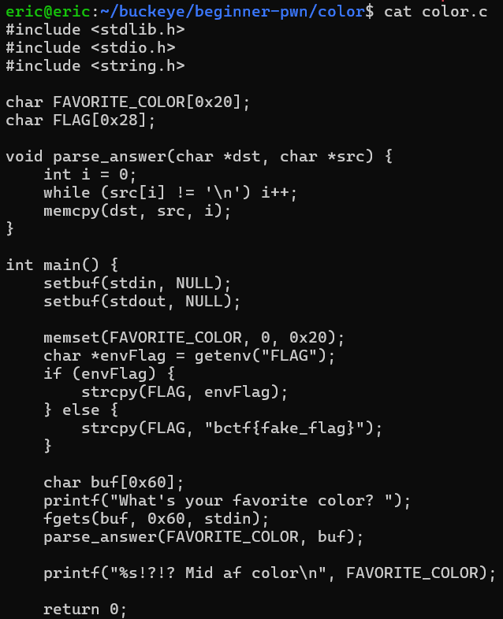
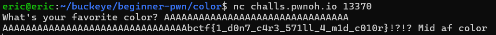

# color
# Category
beginner-pwn
# Description
What's your favorite color?

nc challs.pwnoh.io 13370
# Files
color.zip
# Solution
After downloading the zip file, I immediately unzip it, and there I can find the source code to see what the program is doing:

Since the value of FAVORITE_COLOR is at most 32 characters, I can overflow the buffer as long as the answer I respond with is at least 32 characters long, which would instead print out the flag:

Now I know that the flag is bctf{1_d0n7_c4r3_571ll_4_m1d_c010r}.