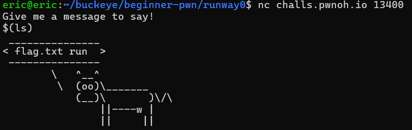
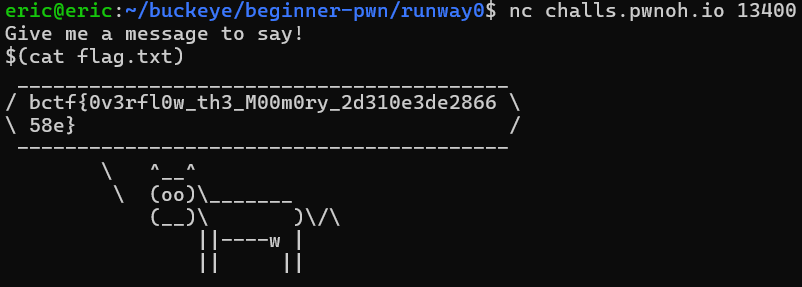

# runway0
# Category
beginner-pwn
# Description
If you've never done a CTF before, this runway should help!

Hint: MacOS users (on M series) will need a x86 Linux VM. Tutorial is here: pwnoh.io/utm

nc challs.pwnoh.io 13400
# Files
runway0.zip
# Solution
After connecting to the program, the first thing I can do is list all available files and directories using ls:

Since I see that there is a file called flag.txt, I assume that's where the flag is stored, so I print it out using cat.

Now I know that the flag is bctf{0v3rfl0w_th3_M00m0ry_2d310e3de286658e}.