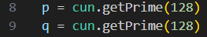
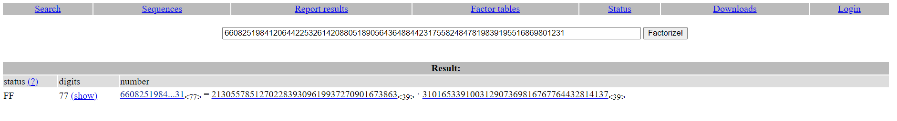
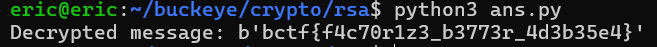

# rsa
# Category
crypto
# Description
https://en.wikipedia.org/wiki/RSA_(cryptosystem)
# Files
[text](rsa.py)
# Solution
This challenge is pretty much just decrypting an RSA encryption system once you know the outputs. First, to successfully decrypt this, I first had to figure out the two randomly generated primary numbers that are essential to solving this, p and q:

Since I'm given n, the product of p and q, I used a factoring website (in this case factordb) to get the factorization for n, which comes out to be:

Since I now know the values of the two primes p and q, I can use the original rsa script and modify it just a bit to decrypt the flag, which gets me:

Now I know that the flag is bctf{f4c70r1z3_b3773r_4d3b35e4}.