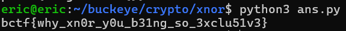

# xnor
# Category
crypto
# Description
XNOR! It's like XOR, but it's actually the complete opposite.
# Files
[text](xnor.py)
[text](xnor_output.txt)
# Solution
After going through the files provided, it's evident that xnor.py is a encryption function that requires a key. However, the key is redacted in the output file, so I have to work backwards with the message and its corresponding encrypted message to find the right key. In order to do this, I used the original xnor.py file and modified it a bit so that it would produce the key, and then figure out the decrypted flag from the key.

[text](ans.py)

After running this python script with python3 ans.py, the following is outputted:

Now I know that the flag is bctf{why_xn0r_y0u_b31ng_so_3xclu51v3}.