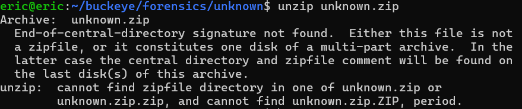
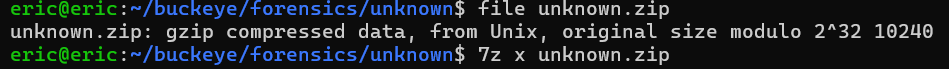
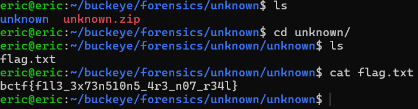

# unknown
# Category
forensics
# Description
Some may call this junk. Me, I call them treasures.
# Files
[unknown.zip](unknown.zip)
# Solution
Since I'm given a zip file, the first thing I do is to unzip it:

However, there seems to be an error, so maybe this isn't actually a zip file. I then used file to check what type of file this actually is, and it's a gzip, so I can unzip it using 7zip:

Afterwards, I get access to a directory called unknown where there is a flag.txt inside of it. Opening up the file, I get the flag:

Now I know that the flag is bctf{f1l3_3x73n510n5_4r3_n07_r34l}.