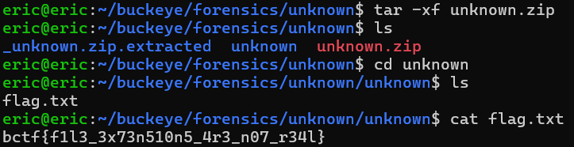

# unknown
# Category
forensics
# Description
Some may call this junk. Me, I call them treasures.
# Files
unknown.zip
# Solution
Since I was given a zip file, the first step is to unzip it, which can be done on the command line using tar -xf unknown.zip. Afterwards, I get access to a directory called unknown where there is a flag.txt inside of it. Opening up the file, I get the flag:

Now I know that the flag is bctf{f1l3_3x73n510n5_4r3_n07_r34l}.