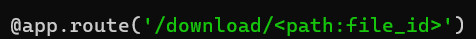
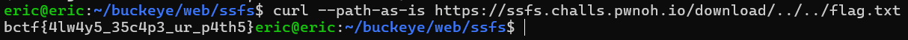

# SSFS
# Category
web
# Description
I made a file server to easily share my files with my friends. Nobody has hacked it yet, so I'm sure it's secure.

ssfs.challs.pwnoh.io
# Files
SSFS.zip
# Solution
The website is just a simple file sharing platform, where you can upload files and search for uploaded files. Next, after I unzip the file, I look at the app.py file to see how the website is actually handling these files. Since only the flag.txt file really matters, I see that the website stores it under ssfs.challs.pwnoh.io/download/<file path>. 

Since I'm not really sure about what the file path is at the moment, I can just look for the flag.txt file at https://ssfs.challs.pwnoh.io/download/flag.txt. However, this fails and there's no page there, but since I know that the file is flag.txt, I can just keep looking a directory further, by using curl.

With curl, I can specify it with '--path-as-is' so that the server doesn't shorten anything, so then I can enter this command into the terminal: curl --path-as-is https://ssfs.challs.pwnoh.io/download/../flag.txt

Without the --path-as-is, the url would be shortened and redirected to /download/flag.txt, but since I specified to read in the path as is, I look forward one directory beyond, since I don't know the exact path to the file. However, this doesn't work either, but the next command, curl --path-as-is https://ssfs.challs.pwnoh.io/download/../../flag.txt, returns the flag:

Now I know that the flag is bctf{4lw4y5_35c4p3_ur_p4th5}.