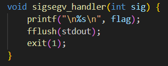
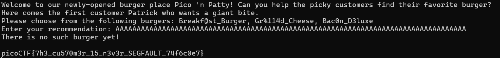

# format string 0
# Category
Binary Exploitation
# Description
Can you use your knowledge of format strings to make the customers happy?
Download the binary here.
Download the source here.
Additional details will be available after launching your challenge instance.
# Files
[format-string-0](format-string-0)
[format-string-0.c](format-string-0.c)
# Hints
1. This is an introduction of format string vulnerabilities. Look up "format specifiers" if you have never seen them before.
2. Just try out the different options
# Solution
First, I took a look at the code to see what it did, and I noticed that the flag is printed when the `sigsegv_handler` is called, so I check to see where the method is called.

After looking around, we can see that the method is called when a segmentation fault occurs, so I just spam a bunch of A's as input.

It works!

Now I know that the flag is `picoCTF{7h3_cu570m3r_15_n3v3r_SEGFAULT_74f6c0e7}`.