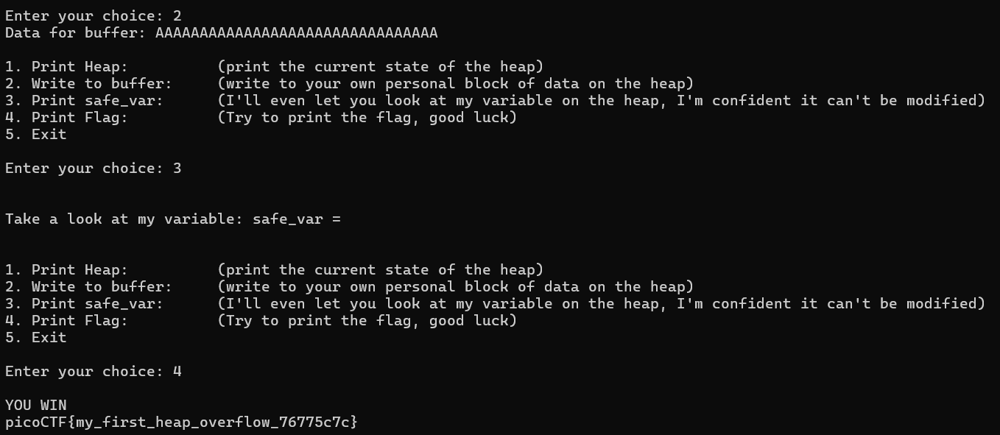

# heap 0
# Category
Binary Exploitation
# Description
Are overflows just a stack concern?
# Files
[chall](chall)
[chall.c](chall.c)
# Hints
1. What part of the heap do you have control over and how far is it from the safe_var?
# Solution
After inspecting the source code, I can see that the distance between the input and the safe_var is exactly 0x20, or 32 bytes long. This means that if I enter at least 32 characters, I can reach the memory of the safe_var and change it, which would give me the flag:

Now I know that the flag is `picoCTF{my_first_heap_overflow_76775c7c}`.