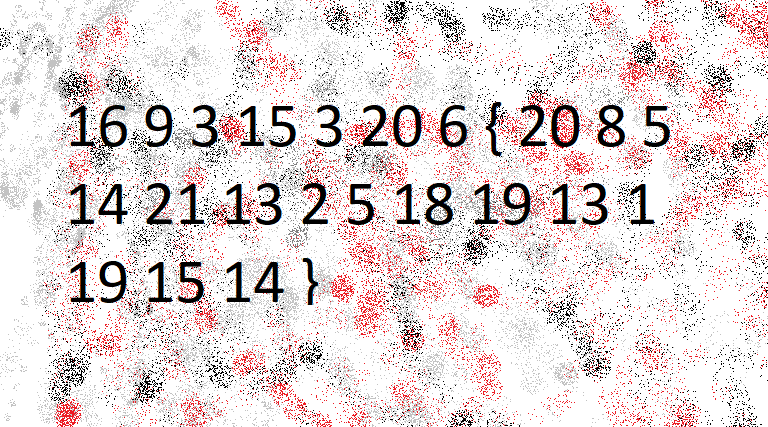

# The Numbers
# Category
Cryptography
# Description
The numbers... what do they mean?
# Files
the_numbers.png
# Hints
1. The flag is in the format PICOCTF{}
# Solution
Since the only thing given in this problem is the file, I open it up first and see a picture with numbers and brackets, which looks like this:

Since I know that the first word of the flag should be picoCTF, I can see that the numbers match up with the letter's alphabetical order. Switching each number for its letter counterpart, I can get the flag.

Now I know that the flag is `picoCTF{thenumbersmason}`.