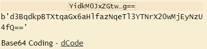
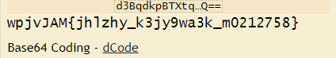
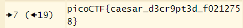

# interencdec
# Category
Cryptography
# Description
Can you get the real meaning from this file.
# Files
[enc_flag](enc_flag)
# Hints
1. Engaging in various decoding processes is of utmost importance
# Solution
In the file, there is a string of encrypted characters, that I assume is the flag. Since it has equal signs at the end, it makes me think that it's base64 encrypted. I use an online decrypter tool like dcode.fr:

Since the resulting string still has the equal signs, I'm going to run it through the decoder again, since the padding makes me think it's base64:

Now that I have something that resembles a flag, I know I'm on the right track. Since the characters still seem spaced out correctly from each other knowing that the beginning will start with picoCTF, I try a caesar cipher:

Now I know that the flag is picoCTF{caesar_d3cr9pt3d_f0212758}.