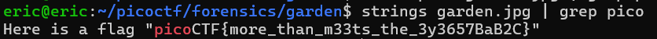

# Glory of the Garden
# Category
Forensics
# Description
This garden contains more than it seems.
# Files
[garden.jpg](garden.jpg)
# Hints
1. What is a hex editor?
# Solution
After downloading this image, I first try to find any hidden messages in the actual picture itself, but there was no hidden text. Next, I tried strings, since that can normally reveal some hidden information. Combined with grep, I can look through all the strings for a hidden flag:

Now I know that the flag is `picoCTF{more_than_m33ts_the_3y3657BaB2C}`.