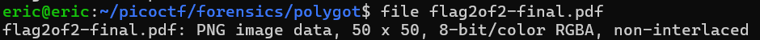
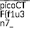
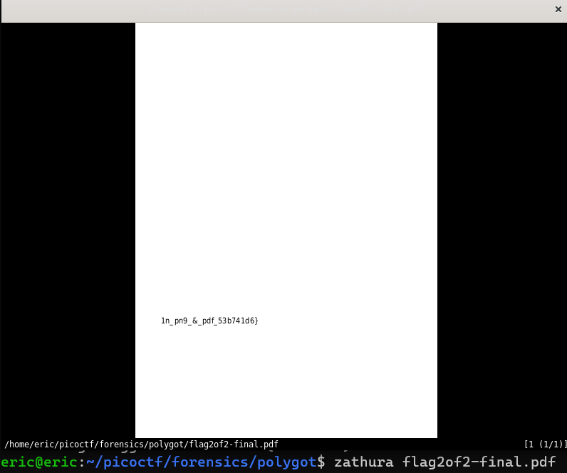

# Secret of the Polyglot
# Category
Forensics
# Description
The Network Operations Center (NOC) of your local institution picked up a suspicious file, they're getting conflicting information on what type of file it is. They've brought you in as an external expert to examine the file. Can you extract all the information from this strange file?
# Files
[flag2of2-final.pdf](flag2of2-final.pdf)
# Hints
1. This problem can be solved by just opening the file in different ways
# Solution
After downloading the file, I check to see what type of file it is:

Since the file turns out to be a png file, I can then use feh to open a png file on linux, and I get the first half of the flag:

Since the file is also a pdf, I can use zathura to open it, and retrieve the second part of the flag there:

Now I know that the flag is picoCTF{f1u3n7_1n_pn9_&_pdf_53b741d6}.