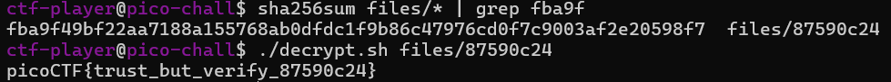

# Verify
# Category
Forensics
# Description
People keep trying to trick my players with imitation flags. I want to make sure they get the real thing! I'm going to provide the SHA-256 hash and a decrypt script to help you know that my flags are legitimate.
The same files are accessible via SSH here:
ssh -p 57431 ctf-player@rhea.picoctf.net
Using the password f3b61b38. Accept the fingerprint with yes, and ls once connected to begin. Remember, in a shell, passwords are hidden!
Checksum: fba9f49bf22aa7188a155768ab0dfdc1f9b86c47976cd0f7c9003af2e20598f7
To decrypt the file once you've verified the hash, run ./decrypt.sh files/<file>.
# Files
Not required
# Hints
1. Checksums let you tell if a file is complete and from the original distributor. If the hash doesn't match, it's a different file.
2. You can create a SHA checksum of a file with sha256sum <file> or all files in a directory with sha256sum <directory>/*.
3. Remember you can pipe the output of one command to another with |. Try practicing with the 'First Grep' challenge if you're stuck!
# Solution
I'm given a bunch of different files, and a checksum that should match the correct file. To get the hash of a file, I can run the 'sha256sum <file>' command, but going through each file one by one would be long and tedious. Instead, I can hash every file at once, by running the command 'sha256sum files/*'. Since the asterisk represents all files, this command would hash every file in the files directory, which is what I want. Now I could go through this line by line looking for the matching hash, but there's a handy command that does it for us: grep. Since I can pipe commands together to chain them, I can pipe the grep command after hashing all the files, in order to find the one that I want. That would look something like this: 
'sha256sum files/* | grep fba9f49bf22aa7188a155768ab0dfdc1f9b86c47976cd0f7c9003af2e20598f7'
Afterwards, I can then run the decrypt script on the correct file in order to get the flag!

Now I know that the flag is picoCTF{trust_but_verify_87590c24}.