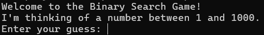
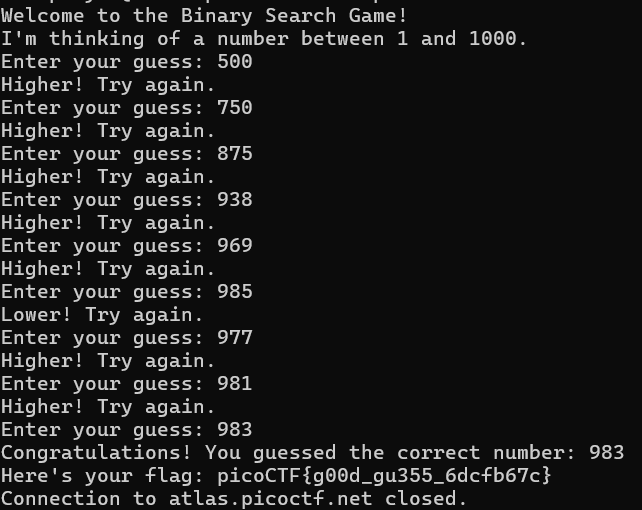

# Binary Search
# Category
General Skills
# Description
Want to play a game? As you use more of the shell, you might be interested in how they work! Binary search is a classic algorithm used to quickly find an item in a sorted list. Can you find the flag? You'll have 1000 possibilities and only 10 guesses.
Cyber security often has a huge amount of data to look through - from logs, vulnerability reports, and forensics. Practicing the fundamentals manually might help you in the future when you have to write your own tools!
ssh -p 57027 ctf-player@atlas.picoctf.net
Using the password f3b61b38. Accept the fingerprint with yes, and ls once connected to begin. Remember, in a shell, passwords are hidden!
# Files
None
# Hints
1. Have you ever played hot or cold? Binary search is a bit like that.
2. You have a very limited number of guesses. Try larger jumps between numbers!
3. The program will randomly choose a new number each time you connect. You can always try again, but you should start your binary search over from the beginning - try around 500. Can you think of why?
# Solution
Once you launch the instance and connect using ssh, you are prompted with the following:

Since I only have 10 guesses for 1000 possibilities, I have to try and gain the most information out of every guess. Since this program tells you whether the number is higher or lower than the one you guessed, starting at 500 would give me the most information and narrow down the possibilities. Depending on what the program responds with, I change the bounds accordingly, and guess at the halfway mark again. For instance, if the program said the number was higher than 500, I'd guess 750 next since now I know the number is between 500 and 1000! Here's what that looks like:

Now I know that the flag is picoCTF{g00d_gu355_6dcfb67c}.