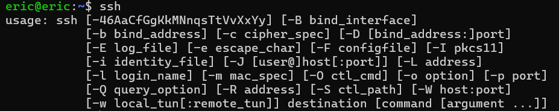

# Super SSH
# Category
General Skills
# Description
Using a Secure Shell (SSH) is going to be pretty important.
Can you ssh as ctf-player to titan.picoctf.net at port 62072 to get the flag?
You'll also need the password f3b61b38. If asked, accept the fingerprint with yes.
If your device doesn't have a shell, you can use: https://webshell.picoctf.org
If you're not sure what a shell is, check out our Primer: https://primer.picoctf.com/#_the_shell
# Files
None
# Hints
1. https://linux.die.net/man/1/ssh
2. You can try logging in 'as' someone with <user>@titan.picoctf.net
3. How could you specify the port?
4. Remember, passwords are hidden when typed into the shell
# Solution
First, we have to know how to connect to a port using SSH, which can be found by entering 'ssh' in the terminal, which brings up this page:

We can see that using -p allows us to enter a port number afterwards, so that's how you connect to a port.In order to ssh as ctf-player to titan.picoctf.net, we simply just have to add '@' between them. Thus, our command is 'ssh -p 62072 ctf-player@titan.picoctf.net', resulting in the following:

Now we know that the flag is picoCTF{s3cur3_c0nn3ct10n_3e293eea}.
