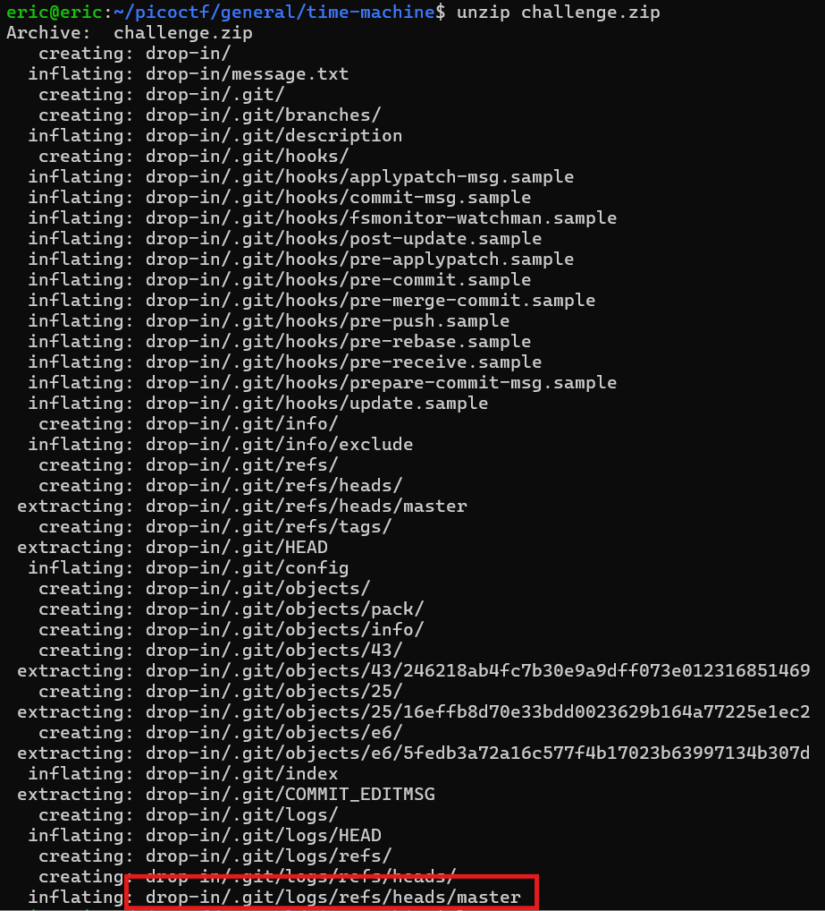
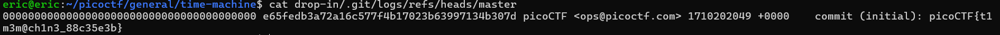

# Time Machine
# Category
General Skills
# Description
What was I last working on? I remember writing a note to help me remember...
# Files
[text](challenge.zip)
# Hints
1. The cat command will let you read a file, but that won't help you here!
2. Read the chapter on Git from the picoPrimer here. (https://primer.picoctf.org/#_git_version_control)
3. When committing a file with git, a message can (and should) be included.
# Solution
After downloading the file, I unzip it and I see that there are logs in the archived data. Since the problem description references forgetting something, it's best to check the master log file:

Now I know that the flag is picoCTF{t1m3m@ch1n3_88c35e3b}.