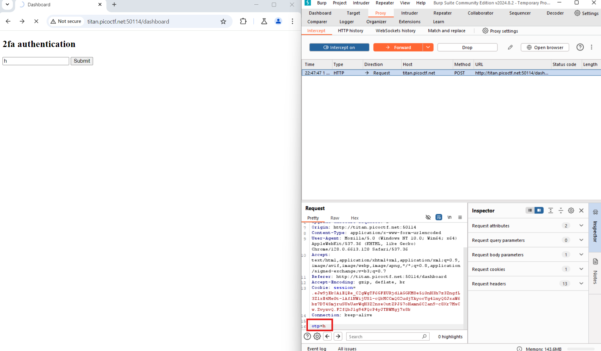
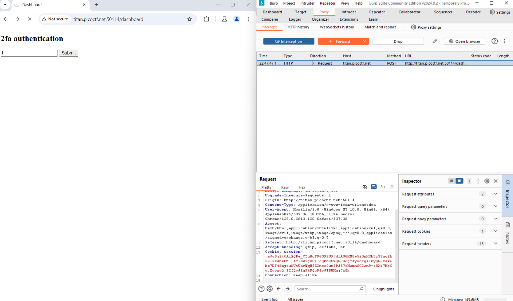
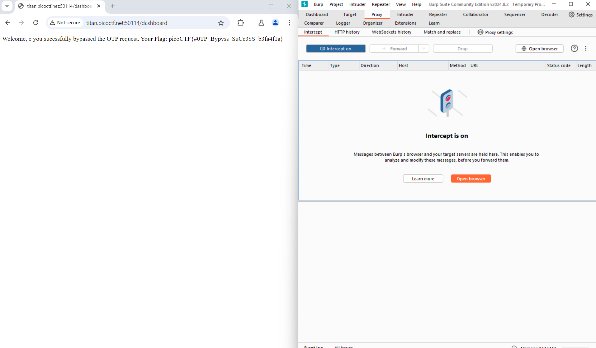

# IntroToBurp
# Category
Web Exploitation
# Description
Try here to find the flag
# Files
http://titan.picoctf.net:50114/
# Hints
1. Try using burpsuite to intercept request to capture the flag.
2. Try mangling the request, maybe their server-side code doesn't handle malformed requests very well.
# Solution
As the name suggests, this challenge is about using Burp Suite to intercept messages to the website. I started up Burp Suite and set up the proxy to intercept the web page, and I began by entering some random information. Afterwards, the site asks for a OTP, which results in an access denied message if you enter one. However, since I can intercept messages sent to the web page, I can simply remove the OTP request, which will bypass it and show me the flag:

Now I know that the flag is picoCTF{#0TP_Bypvss_SuCc3$S_b3fa4f1a}.