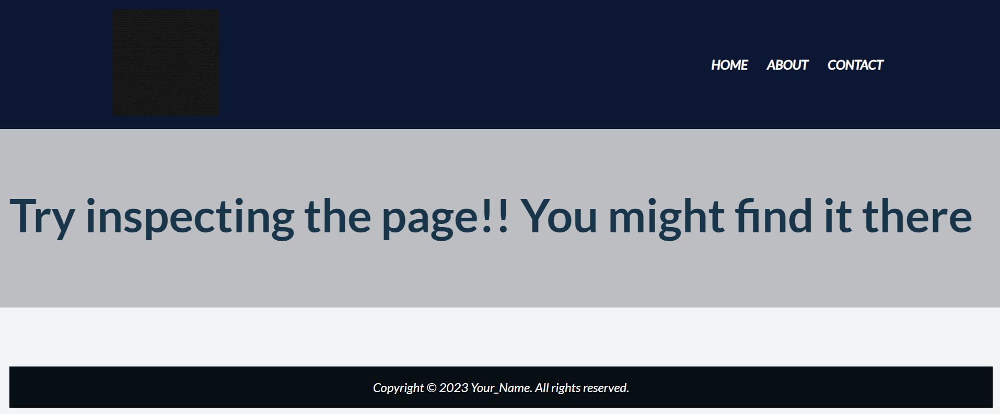
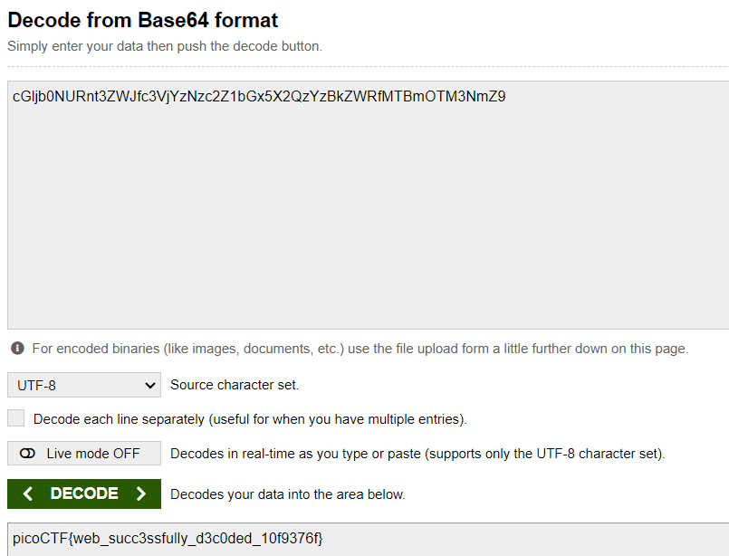

# WebDecode
# Category
Web Exploitation
# Description
Do you know how to use the web inspector?
Start searching here to find the flag
# Files
http://titan.picoctf.net:52585/
# Hints
1. Use the web inspector on other files included by the web page.
2. The flag may or may not be encoded
# Solution
Once I navigated to the website, there are three tabs. Two of the pages tell you to keep looking, while one of them tells you to try inspecting the page. 

I open up inspect element, and in the html, there is a strange string of characters: "cGljb0NURnt3ZWJfc3VjYzNzc2Z1bGx5X2QzYzBkZWRfMTBmOTM3NmZ9". 
This is encrypted using base64, so using an online base64 decoder, I get the decrypted flag.

Now I know that the flag is picoCTF{web_succ3ssfully_d3c0ded_10f9376f}.