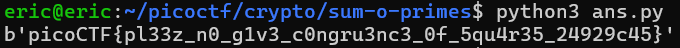

# Sum-O-Primes
# Category
Cryptography
# Description
We have so much faith in RSA we give you not just the product of the primes, but their sum as well!
# Files
[gen.py](gen.py)
[output.txt](output.txt)
# Hints
1. I love squares :)
# Solution
In order to decrypt an RSA encryption algorithm, I will first have to figure out the values of p and q, which is a lot simpler now that I have both their products and sums. With their product as n and sum as x, we can form a quadratic equation, x^2 - sx + n, where the roots are p and q. Thus, I can then use the quadratic formula to get the values of both p and q. 

Since the numbers are too big, I used online calculators and figured out the values of p and q that way. Next, I created a python script to reverse retrieve the ecrypted message: 

```
import binascii

x = 226546681856190263619892616792218130521570032262900236549842672089682515778208912828199358515201866805387062463737665662193399729692506388610482184894766897264590903874257311731561568385258790764817634614996008408916675362993565156633617744400865408980221036805932997456044401299988657076337415409658280341906
n = 12748375556570078931323876348697038029886491950060893186497892699683317310111501916404065392536144464445274333083913910180253319432381125194397252750773181597311793438448103802013908804250712055956932783382160826057817857884706400126928785524023416639273133188054126549943840133256364632699489374831153112912849257351235687536993709519898200527506046169055543255426445369812520133191225616000823928660305132530452791031554731459373681724346453451955400046033943647503543004239988261829585365322656463554537121162528508154784790226768384873003984706798967595704521420442755894365726841231719003175270545612919345882513

p = 122354872100887127778762062872527618538979248256196894411951438464378932202947875086299714656288890147701957899156321387967953516681120744031195323864478574324589472565551936574938778444330170147280615364853453800926355781809167000462072639486591477552676838194577603687719173889895807122769467122844581563217
q = 104191809755303135841130553919690511982590784006703342137891233625303583575261037741899643858912976657685104564581344274225446213011385644579286861030288322940001431308705375156622789940928620617537019250142554607990319581184398156171545104914273931427544198611355393768325227410092849953567948286813698778689
phi = (p - 1) * (q - 1)
e = 65537
c = 10973613181025373836494303450917130987059661836734458345215706851869702117197012842253937846483910307404452085857865745259722119865040707321845296825281145033458825441916700710654793941185838346205571114635803612394852954209233681938383888744362309343081787690827255931228968103235773114580264471933769920192138570272565847344742054992529767750282792607339836888188156563998003178421716411943034076438905987817052219727423475290466700139639611354588099587913505802567172838853518679348568151164402593903829638882901424779010534373623812469392962051811234052002326278244109831996299918732147921376316845109417674626821

d = pow(e, -1, phi)
m = pow(c, d, n)

print(binascii.unhexlify(hex(m)[2:]))
```

After running the script, we get the following result:



Now I know that the flag is `picoCTF{pl33z_n0_g1v3_c0ngru3nc3_0f_5qu4r35_24929c45}`.