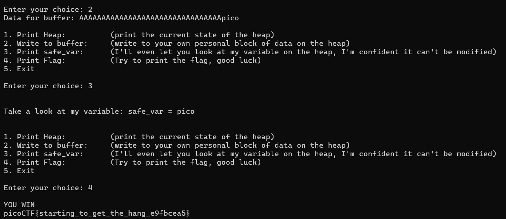

# heap 1
# Category
Binary Exploitation
# Description
Can you control your overflow?
# Files
[chall](chall)
[chall.c](chall.c)
# Hints
1. How can you tell where safe_var starts?
# Solution
After looking at the source code, we can see that the address for safe_var starts 0x20 bytes away from the user input, which means that we can reach the safe_var and effectively alter it after we have entered 32 characters. Next, checking the win() function, we see that it compares the safe_var to "pico", so we just have to change safe_var to pico in order to get the flag. Now, all I have to do is enter in 32 characters followed by pico and I should have the flag:

Now I know that the flag is `picoCTF{starting_to_get_the_hang_e9fbcea5}`.