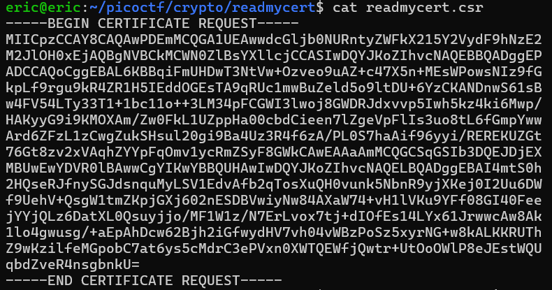
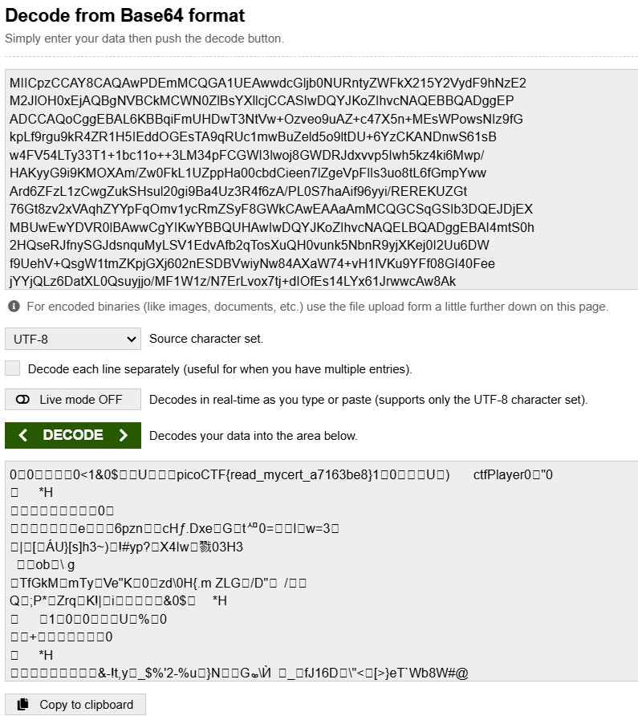

# ReadMyCert
# Category
Cryptography
# Description
How about we take you on an adventure on exploring certificate signing requests
Take a look at this CSR file here.
# Files
[readmycert.csr](readmycert.csr)
# Hints
1. Download the certificate signing request and try to read it.
# Solution
After I downloaded the file, I `cat` it to see if theres anything I can read:

Since I see the equals sign at the end, the first thing I think of is base64. I go on a base64 decoder online and just paste the whole certificate in:

Now I know that the flag is `picoCTF{read_mycert_a7163be8}`.