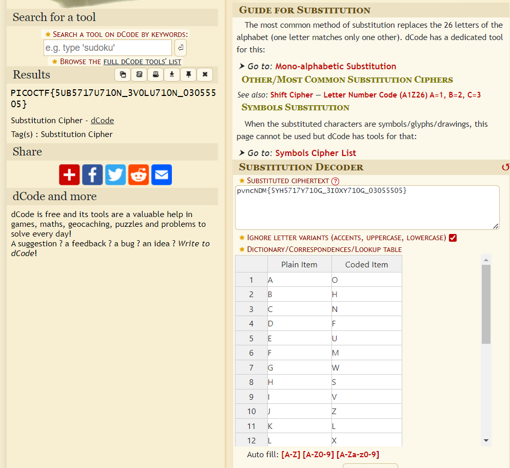

# substitution0
# Category
Cryptography
# Description
A message has come in but it seems to be all scrambled. Luckily it seems to have the key at the beginning. Can you crack this substitution cipher?
# Files
[message.txt](message.txt)
# Hints
1. Try a frequency attack. An online tool might help.
# Solution
The file given just has the substitution key in the beginning, and the encoded flag at the end. All I need to do is search up a substitution cipher decoder online, and enter in the encrypted flag and the key:

Since everything is capitalized in the encoded flag except for the first four letters, I then know that the flag is `picoCTF{5UB5717U710N_3V0LU710N_03055505}`.