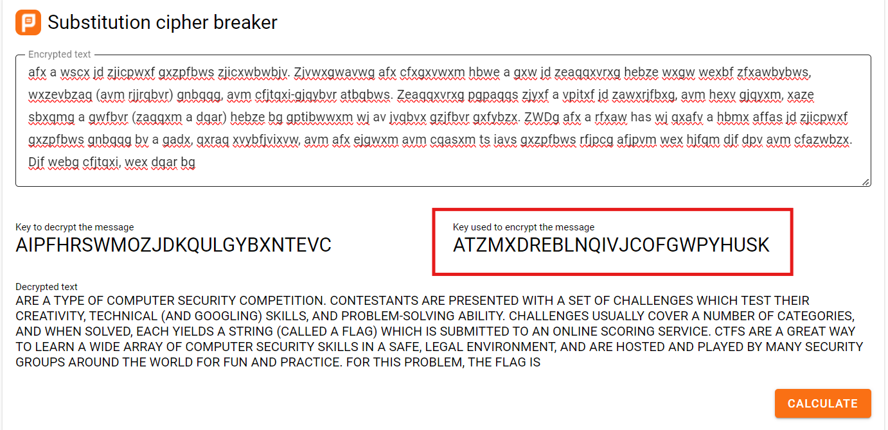
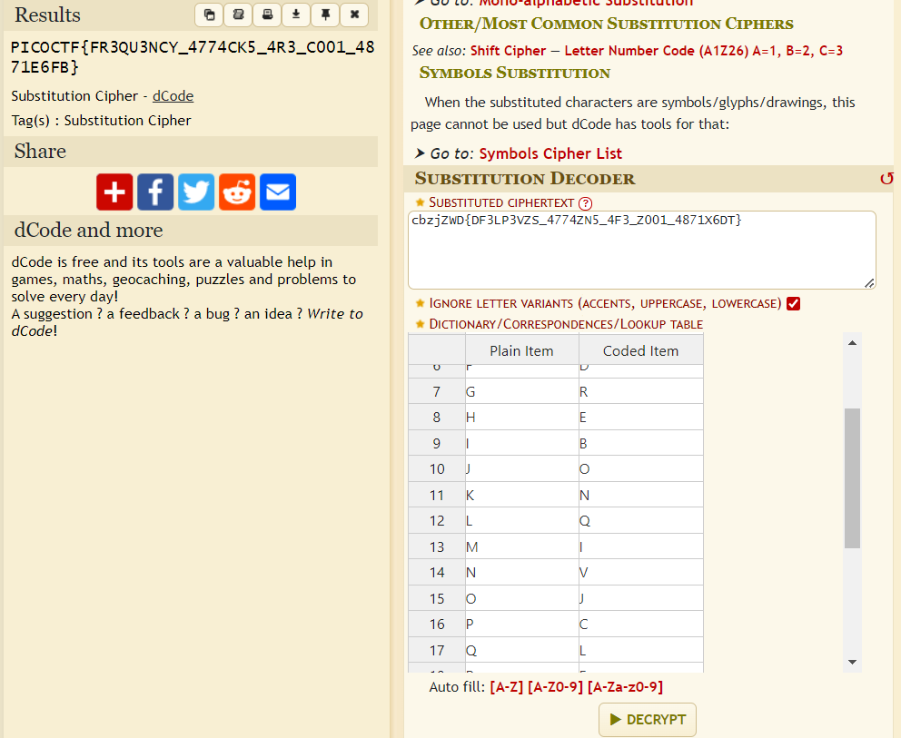

# substitution1
# Category
Cryptography
# Description
A second message has come in the mail, and it seems almost identical to the first one. Maybe the same thing will work again.
# Files
[message.txt](message.txt)
# Hints
1. Try a frequency attack
2. Do the punctuation and the individual words help you make any substitutions?
# Solution
This time, the file is similar but is missing the key which is crucial to decrypting the encoded flag. I just used an online substitution cipher decoder to find a key that results in the most "human-like" english, since the file contains some long sentence:

Now that I have the key, I can just decrypt the cipher using another online tool:

With the key from the other image, the flag that results is actually incorrect, where a 'Q' and 'J' are switched. This can happen since the sample paragraph from the file did not have either of those letters, so they can't really figure out the key correctly. However, I can see that it's supposed to say frequency, so I replaced the two letters.

Now I know that the flag is `picoCTF{FR3QU3NCY_4774CK5_4R3_C001_4871E6FB}`.