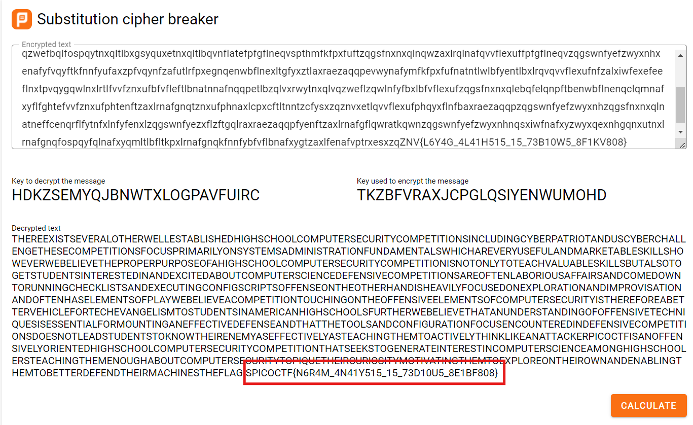

# substitution2
# Category
Cryptography
# Description
It seems that another encrypted message has been intercepted. The encryptor seems to have learned their lesson though and now there isn't any punctuation! Can you still crack the cipher?
# Files
[message.txt](message.txt)
# Hints
1. Try refining your frequency attack, maybe analyzing groups of letters would improve your results?
# Solution
This is pretty much the same as the other two substitution challenges, and I can just take the entire string this time and put it in an online substitution cipher decoder (yes I'm lazy). Anyways, here's the output:

Now I know that the flag is `picoCTF{N6R4M_4N41Y515_15_73D10U5_8E1BF808}`.