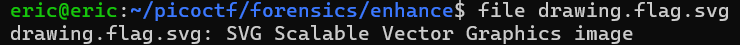
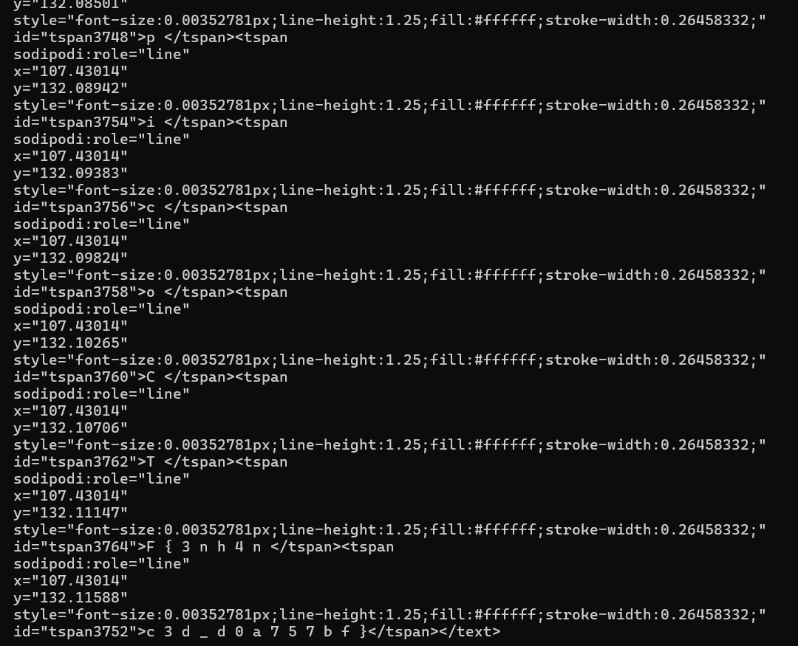

# Enhance!
# Category
Forensics
# Description
Download this image file and find the flag.
# Files

# Hints
None
# Solution
Downloading this file on wsl, I can check the image's file type, which happens to be .svg:

Since this type of file can be scaled inward or outward without losing quality, I determine that I can't simply just zoom in on my browser to see the flag (I tried, there's just another small black dot in the middle). After that, I tried to just print out the file using `cat drawing.flag.svg`, and the flag was there in plaintext:

Piecing together the different parts of the flag, I get that the flag is `picoCTF{3nh4nc3d_d0a757bf}`.