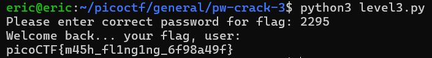

# PW Crack 3
# Category
General Skills
# Description
Can you crack the password to get the flag?
Download the password checker here and you'll need the encrypted flag and the hash in the same directory too.
There are 7 potential passwords with 1 being correct. You can find these by examining the password checker script.
# Files
[level3.py](level3.py)
[level3.hash.bin](level3.hash.bin)
[level3.flag.txt.enc](level3.flag.txt.enc)
# Hints
1. To view the level3.hash.bin file in the webshell, do: $ bvi level3.hash.bin
2. To exit bvi type :q and press enter.
3. The str_xor function does not need to be reverse engineered for this challenge.
# Solution
After taking a look at the script, I realize that there are only seven possible passwords. Since I'm lazy, I just tried every possible password, and eventually got this response with the password "2295":

Now I know that the flag is `picoCTF{m45h_fl1ng1ng_6f98a49f}`.