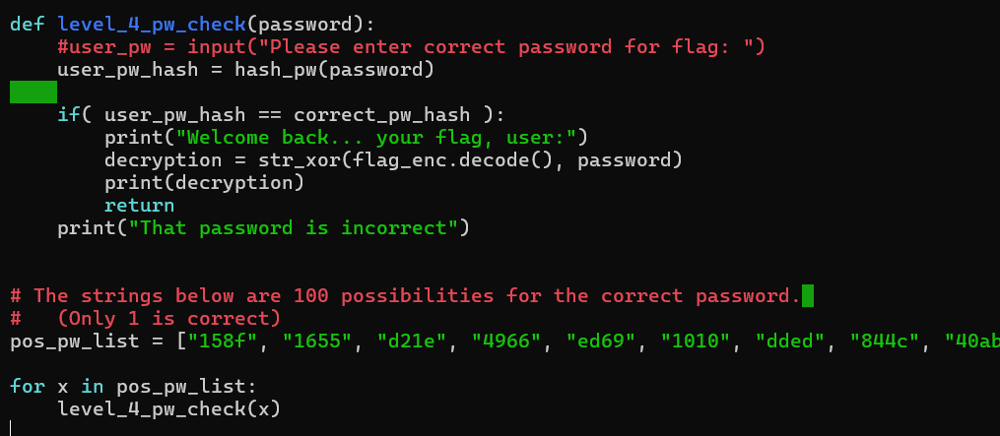
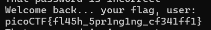

# PW Crack 4
# Category
General Skills
# Description
Can you crack the password to get the flag?
Download the password checker here and you'll need the encrypted flag and the hash in the same directory too.
There are 100 potential passwords with only 1 being correct. You can find these by examining the password checker script.
# Files
[level4.py](level4.py)
[level4.hash.bin](level4.hash.bin)
[level4.flag.txt.enc](level4.flag.txt.enc)
# Hints
1. A for loop can help you do many things very quickly.
2. The str_xor function does not need to be reverse engineered for this challenge.
# Solution
Since there are 100 possibilities this time rather than only seven, I don't think I should brute force by hand. However, the computer's pretty good at brute forcing too, so I'll just modify the python script to do the work for me:

Changing the last part, I just go through the possible password list and try each of them as a possible input. After running this script, I get back a flag:

Now I know that the flag is `picoCTF{fl45h_5pr1ng1ng_cf341ff1}`.