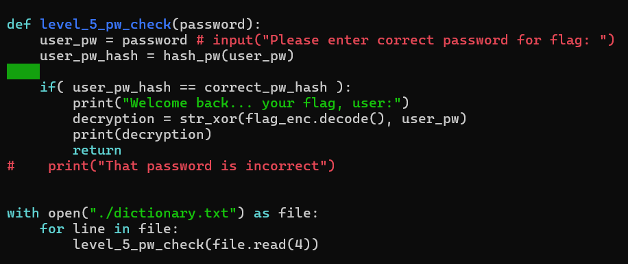
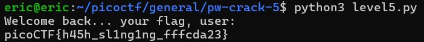

# PW Crack 5
# Category
General Skills
# Description
Can you crack the password to get the flag?
Download the password checker here and you'll need the encrypted flag and the hash in the same directory too. Here's a dictionary with all possible passwords based on the password conventions we've seen so far.
# Files
[level5.py](level5.py)
[level5.hash.bin](level5.hash.bin)
[level5.flag.txt.enc](level5.flag.txt.enc)
[dictionary.txt](dictionary.txt)
# Hints
1. Opening a file in Python is crucial to using the provided dictionary.
2. You may need to trim the whitespace from the dictionary word before hashing. Look up the Python string function, strip
3. The str_xor function does not need to be reverse engineered for this challenge.
# Solution
This challenge is pretty similar to the ones before, but this time we get a whole dictionary of a lot of possible passwords. However, once again, we can just modify the script to read in the inputs from the dictionary as the inputs to the python script to check which password is correct:

Once I run this, I get the following output:

Now I know that the password is `picoCTF{h45h_sl1ng1ng_fffcda23}`.