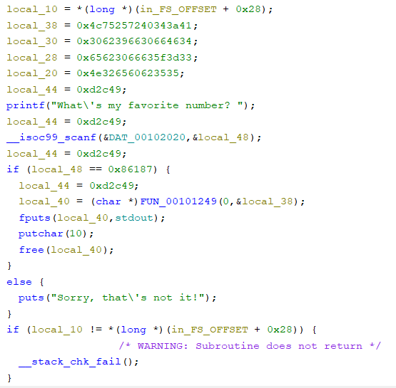
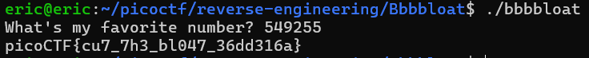

# Bbbbloat
# Category
Reverse Engineering
# Description
Can you get the flag?
Reverse engineer this binary.
# Files
[bbbbloat](bbbbloat)
# Hints
None
# Solution
Since the challenge tells us to reverse engineering the binary, I pull up the file in Ghidra to take a look. 

I can see that the program asks for a favorite number, and then compares it to the hexadecimal number 0x86187, which is 549255 in decimal. Inputting that as our favorite number, the binary then returns the flag:

Now I know that the flag is `picoCTF{cu7_7h3_bl047_36dd316a}`.