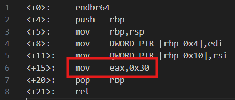

# Bit-O-Asm-1
# Category
Reverse Engineering
# Description
Can you figure out what is in the eax register? Put your answer in the picoCTF flag format: picoCTF{n} where n is the contents of the eax register in the decimal number base. If the answer was 0x11 your flag would be picoCTF{17}.
# Files
[disassembler-dump0_a.txt](disassembler-dump0_a.txt)
# Hints
1. As with most assembly, there is a lot of noise in the instruction dump. Find the one line that pertains to this question and don't second guess yourself!
# Solution
Since the problem asks for the value in the eax register, I can ignore most of the other lines and focus on the line with the eax register:

Since the action is mov, I know that the machine is assigning the value 0x30 to eax, which is equivalent to 48 (3*16).

Hence, the flag is picoCTF{48}.