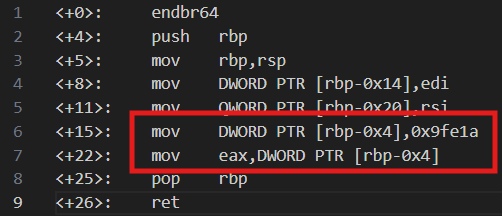

# Bit-O-Asm-2
# Category
Reverse Engineering
# Description
Can you figure out what is in the eax register? Put your answer in the picoCTF flag format: picoCTF{n} where n is the contents of the eax register in the decimal number base. If the answer was 0x11 your flag would be picoCTF{17}.
# Files
[disassembler-dump0_b.txt](disassembler-dump0_b.txt)
# Hints
1. PTR's or 'pointers', reference a location in memory where values can be stored.
# Solution
Since the challenge only asks for the value in the eax register, I can ignore a lot of the other lines and only focus on the ones that are relevant:

Since the action is mov, it's assigning the value of rbp-0x4 to the eax register. In the line above it, we can see that rbp-0x4 is initialized to the value 0x9fe1a, which is equivalent to 654874, which also becomes the value stored in eax.

Therefore, I know that the flag is picoCTF{654874}.