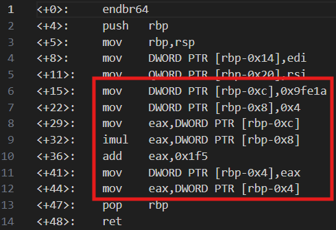

# Bit-O-Asm-3
# Category
Reverse Engineering
# Description
Can you figure out what is in the eax register? Put your answer in the picoCTF flag format: picoCTF{n} where n is the contents of the eax register in the decimal number base. If the answer was 0x11 your flag would be picoCTF{17}.
# Files
[disassembler-dump0_c.txt](disassembler-dump0_c.txt)
# Hints
1. Not everything in this disassembly listing is optimal.
# Solution
Once again, I only have to focus on the parts that relate to the eax register, which is this block of code:

Starting from the top, rbp-0xc is assigned the value 0x9fe1a(654874) and rbp-0x8 is assigned the value 0x4(4). Next, eax is assigned the value of rbp-0xc, which is 654874. Afterwards, eax is multiplied by rbp-0x8, so then eax becomes 4*654874=2619496. Finally, we add 0x1f5(501) to eax, resulting in a value of 2619997. Since the last two lines do nothing to affect the value of eax, the final value remains at 2619997.

Thus, I now know that the flag is picoCTF{2619997}.