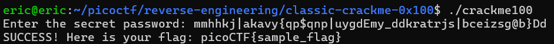

# Classic Crackme 0x100
# Category
Reverse Engineering
# Description
A classic Crackme. Find the password, get the flag!
Crack the Binary file locally and recover the password. Use the same password on the server to get the flag!
Access the server using nc titan.picoctf.net 54374
# Files
[crackme100](crackme100)
# Hints
1. Let the machine figure out the symbols!
# Solution
Since we're being told to analyze the binary, I can use Ghidra to see how the binary actually works. 


After looking at the binary, we can see that the program takes in an input, does a number of operations to it, and then compares the resulting string to "mpknnphjngbhgzyttvkahppevhkmpwgdzyksksokriepnrdm". If they match, then you get the flag! Now all I have to do now is figure out what's happening to the input string.

However, that's a lot of math, and I don't want to do all that math. Instead, I will use angr, since the computer is better at math than I am. First, we have to start angr in a docker container using `docker run -it --rm -v $PWD:/local angr/angr`, and then starting an ipython session using `ipython3`.

Next, we can start building the script:

```
import angr
import claripy
from string import printable

p = angr.Project("./crackme100") # makes a new angr project

USER_DATA_LEN = 50 # we know that the input is checked against a 50 character string
user_data = claripy.BVS("user_data", USER_DATA_LEN*8) # ensures the inputs are also 50 characters
s = p.factory.entry_state(stdin=user_data)
for i in range(USER_DATA_LEN): # loops through every character
    s.solver.add(
        claripy.Or(*(
            user_data.get_byte(i) == x
            for x in printable # makes sure that every character is printable, and not some null byte
        ))
    )
    
sm = p.factory.simgr(veritesting=True) # Initializes a simulation manager, veritesting ensures that every state is new, prevents repeats

sm.run()
```

After running this, the process ends with two deadends:


I can then print each deadend to see which one reached the flag by looping through the deadended list:


Since `concretize()` ensures that symbolic bytes are represented as strings, we can see that the output for the second value in the list is the one that reached the flag. To see the input that resulted in this output, I can simply change the stdout to a stdin, so then we get this:


Even though theres some weird characters in here, the input will still work, so we can then try it out on the local executable:



Since it works locally, I can then connect to the server and try the same input:


Now I know that the flag is `picoCTF{s0lv3_angry_symb0ls_ddcc130f}`.