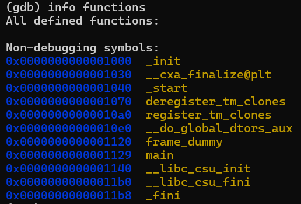
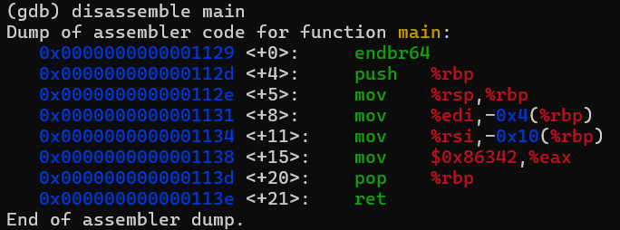

# GDB baby step 1
# Category
Reverse Engineering
# Description
Can you figure out what is in the eax register at the end of the main function? Put your answer in the picoCTF flag format: picoCTF{n} where n is the contents of the eax register in the decimal number base. If the answer was 0x11 your flag would be picoCTF{17}.
# Files
[debugger0_a](debugger0_a)
# Hints
1. gdb is a very good debugger to use for this problem and many others!
2. main is actually a recognized symbol that can be used with gdb commands.
# Solution
As the title of the challenge says, I will use GDB for this challenge. Checking the available functions in this binary, we can see that there is a main function, which is what I want to be focusing on:

Disassembling main, I get:

Since we can see that the program is moving 0x86342 into the eax register, we know that is the flag. Converting the hexadecimal number to base 10, we realize that 0x86342 is equal to 549698.

Now I know that the flag is `picoCTF{549698}`.