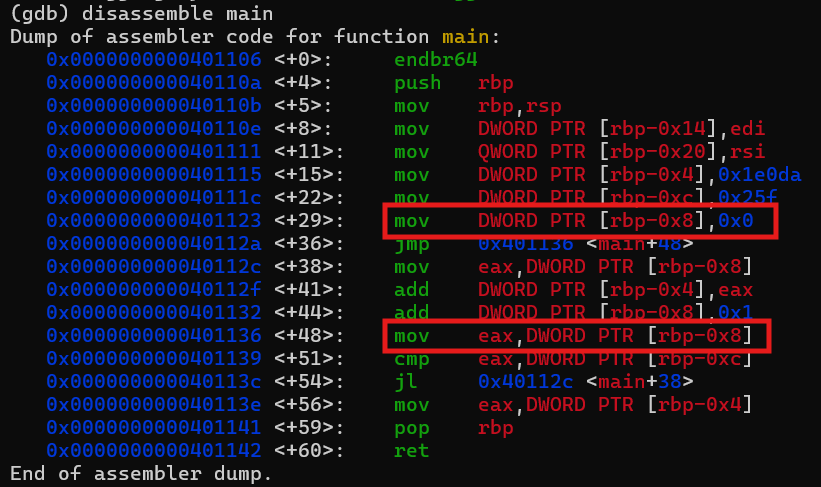

# GDB baby step 2
# Category
Reverse Engineering
# Description
Can you figure out what is in the eax register at the end of the main function? Put your answer in the picoCTF flag format: picoCTF{n} where n is the contents of the eax register in the decimal number base. If the answer was 0x11 your flag would be picoCTF{17}.
# Files
[debugger0_b](debugger0_b)
# Hints
1. You could calculate eax yourself, or you could set a breakpoint for after the calculcation and inspect eax to let the program do the heavy-lifting for you.
# Solution
After downloading the file and using gdb to disassemble the main function, we can see the following:

Now, all I have to do is just trace the value of eax. First, we can see that it is assigned the value of rbp-0x8, which was assigned to the value 0. 

Next, the value is compared to another value, rbp-0xc, which was assigned to 0x25f, or 607 in base 10. Since zero is less than 607, the function jumps to another address. 

Here, the value of eax is added to rbp-0x4, and the value of rbp-0x8 increments, which also increments the value of eax as it is assigned the value of rbp-0x8. Once again, the value of eax is compared to rbp-0xc, which would cause the loop to keep going until the value of eax equals the value of rbp-0xc, or 607. Since eax is added to rbp-0x4 each time, the value of rbp-0x4 is increased by the sum of the numbers from 1-606 (the value of eax increases every loop).

Finally, once eax is equal to 607, the eax register is assigned to the value of rbp-0x4, which is 0x1e0da, or 123098 in base 10, plus the sum of the numbers from 1-606, which happens to be 183421. Now, if you add the two, you get that the eax register contains teh value 307019.

Anyways, now I know that the flag is `picoCTF{307019}`.