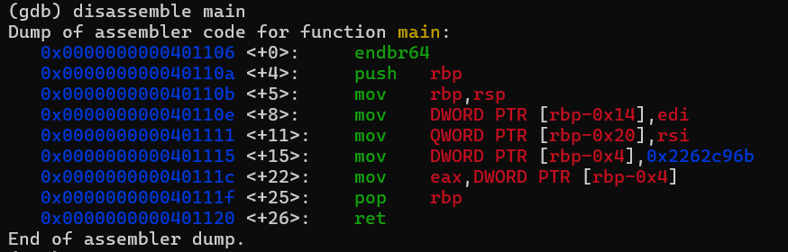
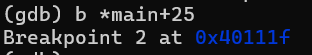
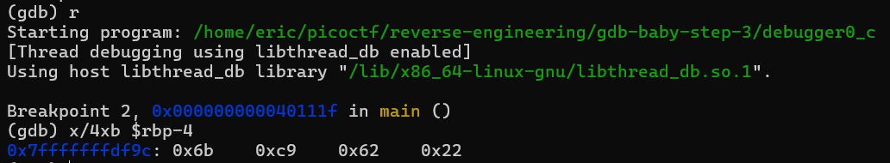

# GDB baby step 3
# Category
Reverse Engineering
# Description
Now for something a little different. 0x2262c96b is loaded into memory in the main function. Examine byte-wise the memory that the constant is loaded in by using the GDB command x/4xb addr. The flag is the four bytes as they are stored in memory. If you find the bytes 0x11 0x22 0x33 0x44 in the memory location, your flag would be: picoCTF{0x11223344}.
# Files
[debugger0_c](debugger0_c)
# Hints
1. You'll need to breakpoint the instruction after the memory load.
2. Use the gdb command x/4xb addr with the memory location as the address addr to examine.
3. Any registers in addr should be prepended with $ like $rbp.
4. Don't use square brackets for addr
5. What is endianness?
# Solution
Once I download the file and run gdb, I can then disassemble main and see what's actually going on in the program. Since I have to figure out what's stored in the memory location, I have to find where it is stored first:

Since we can see that the memory is set to rbp-0x4 during the program, I set a breakpoint before the program ends and after the memory is loaded so that I can analyze rbp-0x4:

Then, after running the program, we can get the bytes stored in rbp-0x4 using the x/4xb command, and we get:

Following the convention for the flag, I now know that the flag is `picoCTF{0x6bc96222}`.