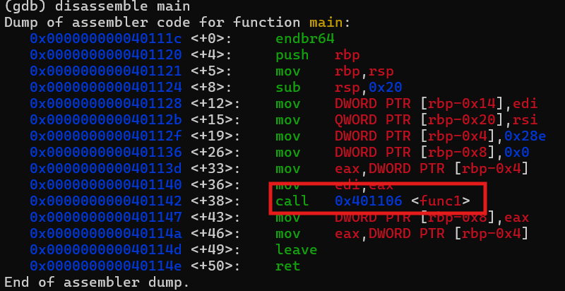
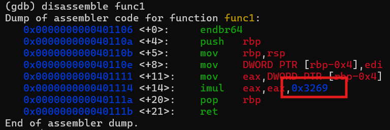

# GDB baby step 4
# Category
Reverse Engineering
# Description
main calls a function that multiplies eax by a constant. The flag for this challenge is that constant in decimal base. If the constant you find is 0x1000, the flag will be picoCTF{4096}.
# Files
[debugger0_d](debugger0_d)
# Hints
1. A function can be referenced by either its name or its starting address in gdb.
# Solution
Once again, I first download the file and run gdb since well, just look at the name of the challenge. Anyways, the description reveals that there is a method called in main that we need to analyze, so I first disassemble main to look for this function:

Since I now know the name of the function, I can then disassemble that to look for the constant:

We can see that the program assigns the value of eax to eax multiplied by this hexadecimal number, so we know that this has to be the constant.

Converting the number to base 10, I then know that the flag is `picoCTF{12905}`.