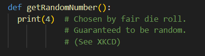
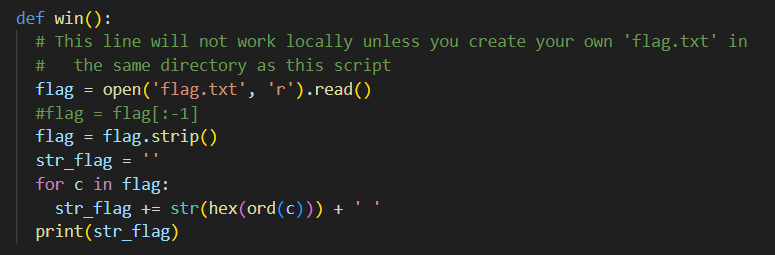
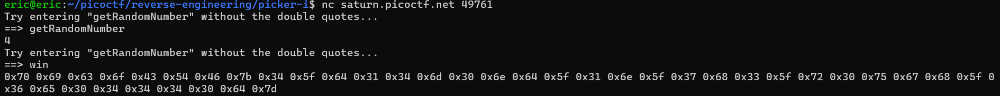

# Picker I
# Category
Reverse Engineering
# Description
This service can provide you with a random number, but can it do anything else?
# Files
[picker-I.py](picker-I.py)
# Hints
1. Can you point the program to a function that does something useful for you?
# Solution
Once I downloaded the python script, there seems to be a lot of unnecessary information that are all commented out. There are two important functions, getRandomNumber() and win():

Once I connected to the program through netcat, it asked me to try entering "getRandomNumber" without the parenthesis, which happens to be the name of the function. When I entered it, the function ran, so then I tried entering "win" next in order to call the win function, which would reveal the flag:

I then used an ASCII to text decoder, and now I know that the flag is `picoCTF{4_d14m0nd_1n_7h3_r0ugh_6e04440d}`.