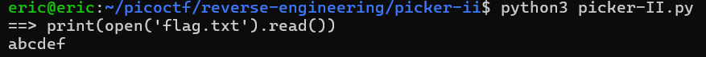
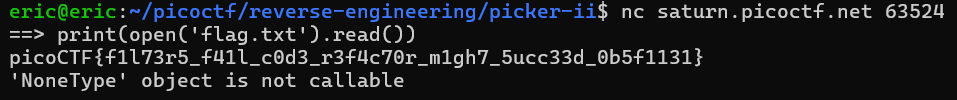

# Picker II
# Category
Reverse Engineering
# Description
Can you figure out how this program works to get the flag?
Connect to the program with netcat:
nc saturn.picoctf.net 63524
# Files
[picker-II.py](picker-II.py)
# Hints
1. Can you do what win does with your input to the program?
# Solution
After looking at the code, I can see that we need to somehow call the win function, but it is denied by the filter function, so I need to find a workaround. Looking at the code, we can see that it runs whatever line we pass into it. Since I know that the flag is stored in flag.txt, I can just read the file and print it out using `print(open('flag.txt').read())`.

Since it worked with the local file, we can then do the same after connecting to the program:

Now I know that the flag is `picoCTF{f1l73r5_f41l_c0d3_r3f4c70r_m1gh7_5ucc33d_0b5f1131}`.