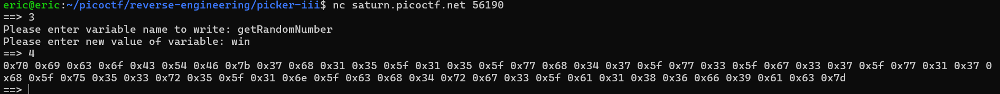
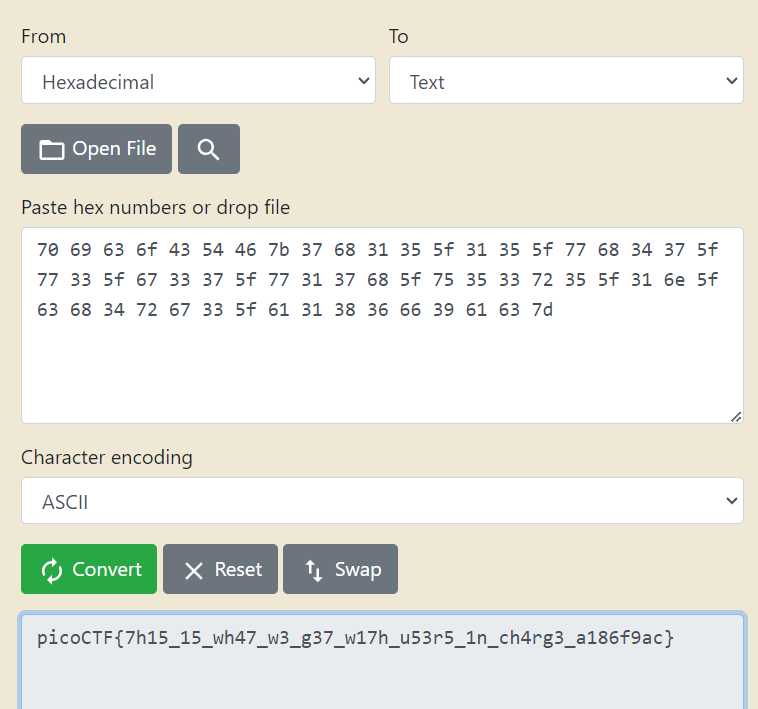

# Picker III
# Category
Reverse Engineering
# Description
Can you figure out how this program works to get the flag?
Connect to the program with netcat:
nc saturn.picoctf.net 56190
# Files
[picker-III.py](picker-III.py)
# Hints

# Solution
After looking at the code, we can see that there is an interesting function which can be used to edit a variable name. There also happens to be a win function, which should be the name we rewrite another variable with:

After rewriting the variable, the function returns us the hex value of the flag. After changing it to a string value, we can finally get the flag:

Now I know that the flag is `picoCTF{7h15_15_wh47_w3_g37_w17h_u53r5_1n_ch4rg3_a186f9ac}`.