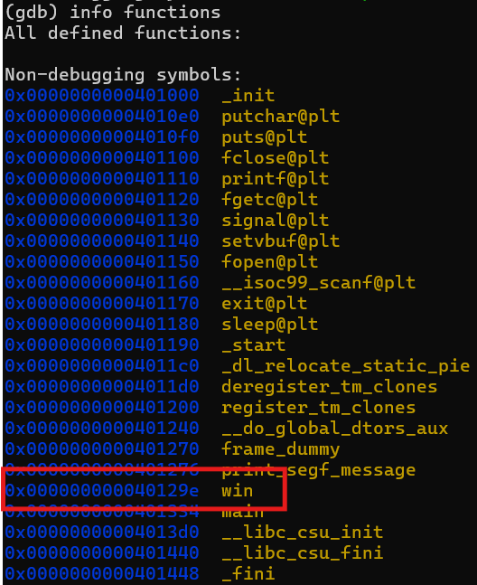
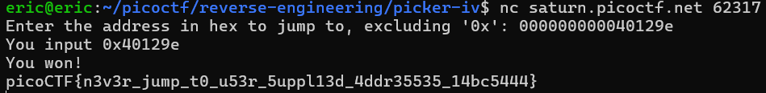

# Picker IV
# Category
Reverse Engineering
# Description
Can you figure out how this program works to get the flag?
Connect to the program with netcat:
nc saturn.picoctf.net 62317
# Files
[picker-IV](picker-IV)
[picker-IV.c](picker-IV.c)
# Hints
1. With Python, there are no binaries. With compiled languages like C, there is source code, and there are binaries. Binaries are created from source code, they are a conversion from the human-readable source code, to the highly efficient machine language, in this case: x86_64.
2. How can you find the address that win is at?
# Solution
After looking at the code, I can see that there is a win function which will return the flag. In order to get there, as the program says, I have to enter an address, so I know that if I enter the address of the win function, the program will jump to it and return me the flag. Using gdb, I can use the command `info functions` to find the address of the win function:

Since I now know the address of the function, I use it as my input which will hopefully return me the flag:

Now I know that the flag is `picoCTF{n3v3r_jump_t0_u53r_5uppl13d_4ddr35535_14bc5444}`.