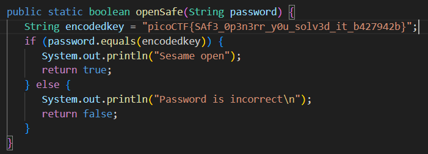

# Safe Opener 2
# Category
Reverse Engineering
# Description
What can you do with this file?
I forgot the key to my safe but this file is supposed to help me with retrieving the lost key. Can you help me unlock my safe?
# Files
[SafeOpener.class](SafeOpener.class)
# Hints
1. Download and try to decompile the file.
# Solution
Decompiling the file using FernFlower, I can pretty easily see the java code, which also happens to include the flag printed in plaintext:

Anyways, I can now just copy this and now I know that the flag is `picoCTF{SAf3_0p3n3rr_y0u_solv3d_it_b427942b}`.