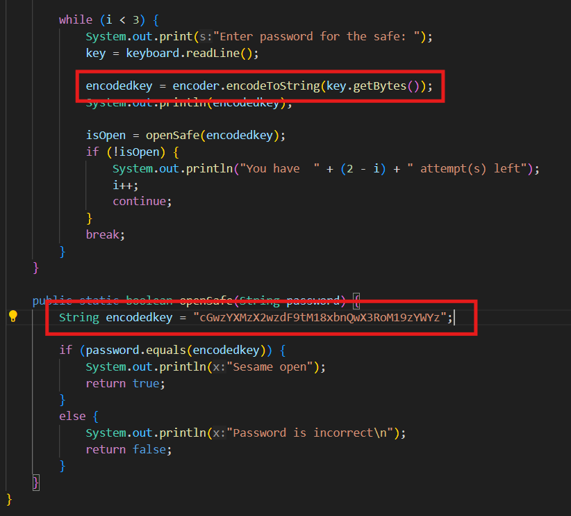
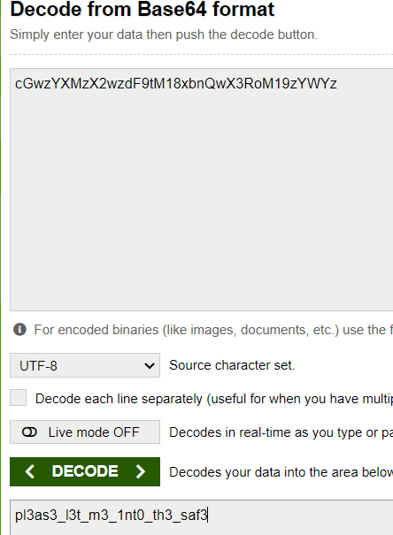

# Safe Opener
# Category
Reverse Engineering
# Description
Can you open this safe?
I forgot the key to my safe but this program is supposed to help me with retrieving the lost key. Can you help me unlock my safe?
Put the password you recover into the picoCTF flag format like:
picoCTF{password}
# Files
[SafeOpener.java](SafeOpener.java)
# Hints
None
# Solution
After taking a look at the program, I can see that it asks for a password, encrypts it, and then checks it against a string to see if the password is correct. 

Since we know that the encodeToString() function encrypts using a base64 cipher, I can just take the string that the password is being compared to and run it through a base64 decrypter:

Following the format, I now know that the flag is `picoCTF{pl3as3_l3t_m3_1nt0_th3_saf3}`.