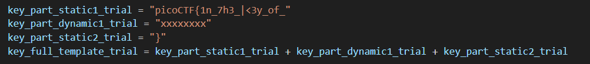
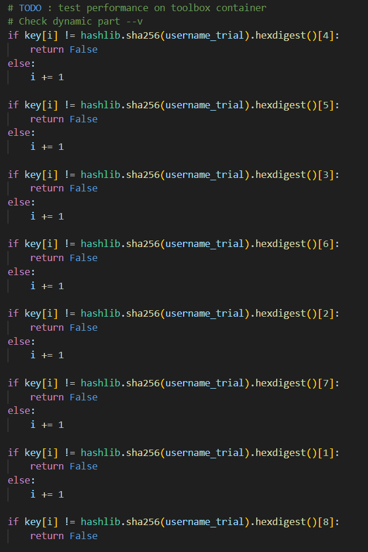
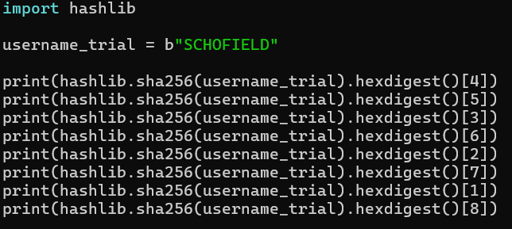
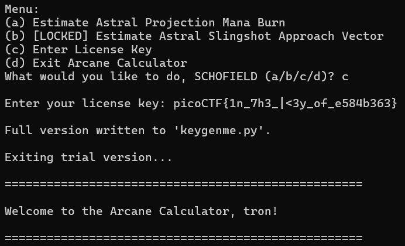

# keygenme-py
# Category
Reverse Engineering
# Description
None
# Files
[keygenme-trial.py](keygenme-trial.py)
# Hints
None
# Solution
After looking at the program, we can see that there is a dynamic part of the flag that goes through some transformation, and we have to figure out what that does, since we already know the other parts of the flag:

After further inspection, I can see that the function that reveals the flag checks for a key using this:

Knowing this, I then wrote a python script to get each value:

This returned the value `e584b363`, which I now know is the dynamic part of the flag. Now I can combine all three parts of the flag and unlock the full version of the Arcane Calculator!

Now I know that the flag is `picoCTF{1n_7h3_|<3y_of_e584b363}`.