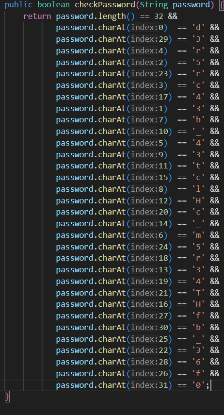

# vault-door-1
# Category
Reverse Engineering
# Description
This vault uses some complicated arrays! I hope you can make sense of it, special agent.
# Files
[VaultDoor1.java](VaultDoor1.java)
# Hints
1. Look up the charAt() method online.
# Solution
After looking at the code, it's clear that the password is just scrambled a bit. However, since it gives me the indices of the characters, I can just count up from 0.

Now I know that the flag will be `picoCTF{d35cr4mbl3_tH3_cH4r4cT3r5_ff63b0}`.