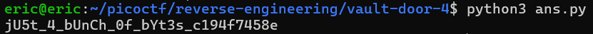

# vault-door-4
# Category
Reverse Engineering
# Description
This vault uses ASCII encoding for the password.
# Files
[VaultDoor4.java](VaultDoor4.java)
# Hints
1. Use a search engine to find an "ASCII table".
2. You will also need to know the difference between octal, decimal, and hexadecimal numbers.
# Solution
After analyzing the code, we can see that the program compares the user input to an array of characters, which involve many different bases:

```
byte[] myBytes = {
    106 , 85  , 53  , 116 , 95  , 52  , 95  , 98  ,
    0x55, 0x6e, 0x43, 0x68, 0x5f, 0x30, 0x66, 0x5f,
    0142, 0131, 0164, 063 , 0163, 0137, 0143, 061 ,
    '9' , '4' , 'f' , '7' , '4' , '5' , '8' , 'e' ,
};
```

We can see the first three rows are ASCII values probably, while the last row is just the byte. The first row is most likley decimal, second row hexadecimal, and third row octal. I can then write a script to turn all these numbers into characters:

```
myBytes = [
    106 , 85  , 53  , 116 , 95  , 52  , 95  , 98  ,
    0x55, 0x6e, 0x43, 0x68, 0x5f, 0x30, 0x66, 0x5f,
    0o142, 0o131, 0o164, 0o63 , 0o163, 0o137, 0o143, 0o61
]

print("".join(map(chr, myBytes)) + "94f7458e")
```

After running this, I get back:



So now I know that the flag is `picoCTF{jU5t_4_bUnCh_0f_bYt3s_c194f7458e}`.